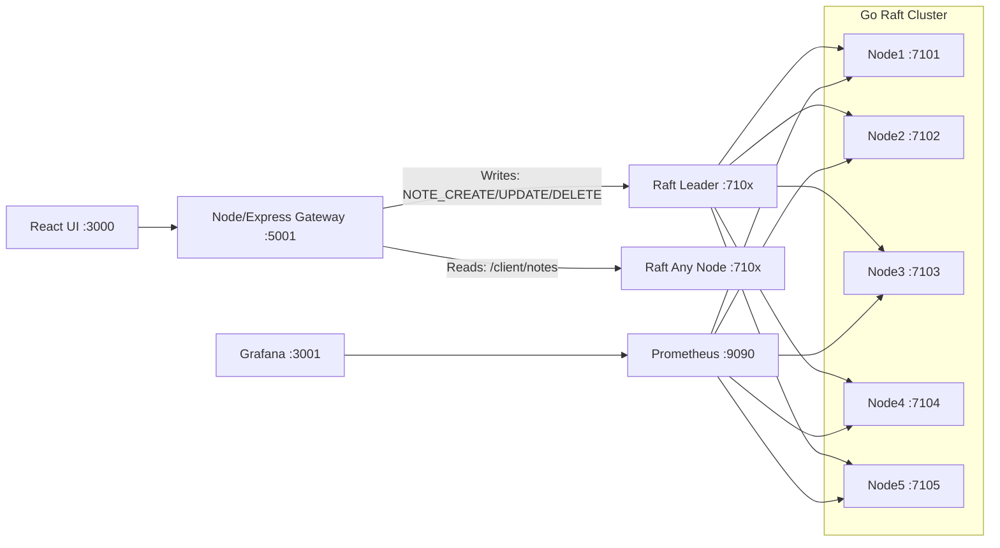

# iNoteBook — Raft-backed Distributed Notes Cluster (5 Nodes) + Prometheus + Grafana

A full-stack notes app where **writes go to a Raft leader**, get replicated across a **5-node Go cluster**, and you can **watch leader elections + replication health live** in Grafana.

This is not “just CRUD”. This is **distributed consensus + durability + observability**.

---

## What this project delivers

### ✅ Full-stack Notes App (React + Node/Express)
- JWT auth
- Create, read, update, delete notes
- Optional exports
  - Upload notes JSON to **Google Cloud Storage**
  - Insert notes into **BigQuery**

### ✅ Distributed Storage (Go + Raft)
- 5 nodes (`7101`–`7105`)
- Leader/follower replication
- Follower redirect on writes
- Persistent WAL per node (`log.jsonl`) so data survives restarts

### ✅ Observability (Prometheus + Grafana)
- Each node exposes `GET /metrics`
- Prometheus scrapes all nodes
- Grafana dashboard shows:
  - leader vs followers
  - commit index
  - apply lag
  - rpc errors
  - term changes (elections)

---

## Architecture

## Tech Stack (Production-style, detailed)

### Frontend (Web UI)
- **React (SPA)**  
  - Notes CRUD UI, auth flows, dashboards, export actions
- **React Router**  
  - Page routing (Home, Reminders, Auth, etc.)
- **Context API / State management**  
  - Auth state (JWT), notes state, UI sync after writes
- **Fetch / REST client**  
  - Calls Node gateway APIs (`/api/auth/*`, `/api/notes/*`)
- **UI layer**
  - Bootstrap / CSS utilities (layout, components)

---

### Backend (API Gateway)
- **Node.js + Express**
  - Acts as the **gateway** between UI and distributed Raft cluster
  - Exposes stable REST endpoints to frontend:
    - `GET /api/notes/fetchAllNotes`
    - `POST /api/notes/addnotes`
    - `PUT /api/notes/updatenote/:id`
    - `DELETE /api/notes/deletenote/:id`
- **JWT Authentication**
  - Signed JWT token stored on client
  - Middleware validates token per request (`fetchUser`)
- **express-validator**
  - Request validation for note payloads (title/description)
- **Cluster client (Node service layer)**
  - Leader discovery + redirect handling on writes
  - Reads can hit any node (optional: “read from leader only” mode)
- **MongoDB (User/Auth storage)**
  - Stores users, credentials, metadata
  - Notes are NOT stored here when Raft cluster is enabled (notes live in the distributed store)
- **Google Cloud integrations (optional exports)**
  - **Service Account auth**
  - **GCS export** (JSON object export)
  - **BigQuery insert** (analytics rows)

---

### Distributed System (Raft Notes Cluster)
- **Go (Golang)**
  - 5-node cluster (`7101`–`7105`)
- **Raft consensus (leader-based replication)**
  - **Leader** accepts writes (`/client/command`)
  - **Followers** replicate log entries via append entries
  - Followers return **redirect fields** so gateway can forward writes to leader
- **State Machine**
  - Applies replicated commands:
    - `NOTE_CREATE`, `NOTE_UPDATE`, `NOTE_DELETE`
- **WAL persistence (Write-Ahead Log)**
  - Per-node durable log: `distributed-notes-cluster/.data/nodeX/log.jsonl`
  - Allows recovery after restart
- **Raft metadata persistence**
  - Per-node metadata: `distributed-notes-cluster/.data/nodeX/state.json`  
    (`term`, `voted_for`, etc.)

---

### Observability / Monitoring
- **Prometheus**
  - Scrapes `GET /metrics` from each node
  - Stores time-series metrics for analysis + alerting
- **Grafana**
  - Dashboard visualisation for cluster health + leader election
- **Raft metrics exposed**
  - `raft_role` (0 follower, 1 candidate, 2 leader)
  - `raft_current_term`
  - `raft_log_length`
  - `raft_commit_index`
  - `raft_last_applied`
  - `raft_rpc_errors_total`

---

### Google Cloud (Export + Analytics)
- **Google Cloud Service Account (IAM)**
  - Used by backend for secure server-to-server authentication
  - Recommended minimal roles:
    - **GCS:** `Storage Object Admin` (or tighter: `Object Creator` + `Object Viewer`)
    - **BigQuery:** `BigQuery Data Editor` + `BigQuery Job User` (or dataset-scoped permissions)
- **Google Cloud Storage (GCS)**
  - Used to export notes as JSON for backup/share pipelines
  - Typical format: `notes/<user_id>/<timestamp>.json`
- **BigQuery**
  - Used to insert notes as rows for analytics dashboards
  - Supports queries like:
    - notes created per day/week
    - tag distribution
    - user activity volume
    - time-based trends

---

## What each part does (core system behavior)

### 1) Frontend (React UI)
- Collects user input and displays notes.
- Calls gateway APIs and updates UI state.
- Does not talk directly to Raft nodes (keeps cluster internal and secure).

### 2) Backend Gateway (Node/Express)
This is the “production move”.
- **Auth boundary:** validates JWT and enforces user scope.
- **API boundary:** provides consistent REST interface to UI.
- **Cluster boundary:** handles Raft leader routing so frontend stays simple.

**Write flow (create/update/delete):**
1. UI calls `POST /api/notes/addnotes`
2. Backend builds a Raft command payload
3. Backend discovers leader (or follows redirect) and sends to:
   - `POST http://<leader>/client/command`
4. Cluster replicates + commits
5. Backend returns the created note to UI

**Read flow (fetch all notes):**
1. UI calls `GET /api/notes/fetchAllNotes`
2. Backend reads from cluster:
   - `GET http://<any-node>/client/notes?user_id=<id>`
3. Backend maps cluster note schema → frontend schema

> If you want “read-your-write consistency”, set reads to leader only.

### 3) Distributed Cluster (Go + Raft)
- Guarantees **one leader at a time**.
- Guarantees committed commands replicate before being “successful”.
- Persists replicated commands in WAL (`log.jsonl`) so restart doesn’t lose state.

This gives you:
- leader election
- replication
- durability
- eventual read consistency across nodes

### 4) Prometheus (metrics collector)
- Polls each node’s `/metrics` endpoint every few seconds.
- Stores Raft health data over time.
- Enables querying like:
  - “who was leader for the last 30 minutes”
  - “is apply lag growing”
  - “are rpc errors spiking”

### 5) Grafana (visual + operational)
- Shows cluster health at a glance.
- Core dashboard panels:
  - **Leader election:** `raft_role` with value mappings (Follower/Candidate/Leader)
  - **Replication health:** `raft_commit_index` and lag (`commit - applied`)
  - **Stability:** term changes (leader churn)
  - **Networking:** rpc error rate

### 6) BigQuery (analytics use cases)
BigQuery is not for serving notes in realtime.
It’s for analysis, trends, and dashboards.
Examples:
- usage trends per day/week
- top tags / categories
- most active users (for admin analytics)
- anomaly detection signals (future extension)

### 7) GCS (export / backup use cases)
- Long-term object storage for JSON exports.
- Use cases:
  - backups
  - sharing data with other systems
  - feeding a data pipeline
  - audit snapshots

---

## Required configuration (Cloud, optional)

### Environment variables (Backend)
Set these in backend runtime (example names — match your code):
- `GOOGLE_APPLICATION_CREDENTIALS=/path/to/service-account.json`
- `GCS_BUCKET_NAME=<bucket>`
- `BQ_PROJECT_ID=<project>`
- `BQ_DATASET=<dataset>`
- `BQ_TABLE=<table>`

### Service Account (recommended)
- Create a service account in GCP
- Download JSON key (local dev only)
- Give minimal permissions:
  - GCS bucket scoped
  - BigQuery dataset scoped

> Never commit service account keys to GitHub.

